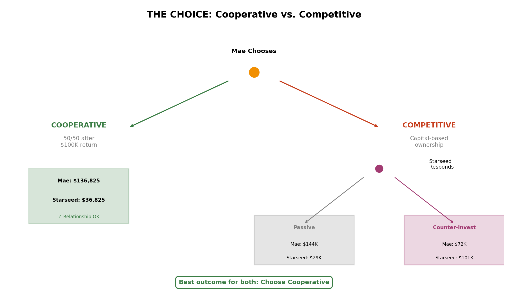

# Game Theory Analysis: Cooperative vs. Competitive Ownership

## The Meta-Game

Before deciding *how* to split ownership, you must first decide *what game you're playing*.

| Mode | Philosophy | Rules |
|------|------------|-------|
| **Cooperative** | "We're partners building something together" | Equal profit sharing, all contributions valued |
| **Competitive** | "We're investors maximizing individual returns" | Capital dominates, bigger investor wins more |

**The critical insight:** You cannot play both games simultaneously.

---

## Game Mode 1: Cooperative ("Partners")

### How It Works

```
At Sale:
1. Mae's parents get $100K back (return OF capital)
2. Remaining proceeds split 50/50 (return ON capital)
```

### Example: Year 5, Base Case ($173,650 net proceeds)

| Step | Amount |
|------|--------|
| Net proceeds | $173,650 |
| Mae's parents' return | -$100,000 |
| Remaining to split | $73,650 |
| Mae receives | $100,000 + $36,825 = **$136,825** |
| Starseed receives | **$36,825** |

### Pros
- Simple to calculate and explain
- No ongoing tracking required
- Relationship-preserving

### Cons
- Doesn't reward additional capital investment
- May feel "unfair" to whoever contributes more cash

---

## Game Mode 2: Competitive ("Investors")

### How It Works

```
Ownership % = Your Capital Invested / Total Capital Invested
Payout = Net Proceeds x Your Ownership %
```

### The Current Competitive Position (Year 5)

| Party | Capital Invested | Ownership % |
|-------|------------------|-------------|
| Mae's parents | $100,000 | 66.5% |
| Mae (principal paid) | $25,185 | 16.75% |
| Starseed (principal paid) | $25,185 | 16.75% |

### Who This Favors
**Mae** -- Her parents' front-loaded capital dominates.

---

## The Strategic Pivot: Starseed's Competitive Counter-Move

If competitive mode is chosen, Starseed has a powerful option:

| Scenario | Starseed Invests | Starseed Ownership |
|----------|------------------|-------------------|
| Current (no action) | $25,185 | 16.75% |
| Pay off parents | $100,000 | 50% |
| Majority position | $150,000 | 58% |
| Dominant position | $200,000 | 64% |

---

## The Choice Matrix



| If Mae Chooses... | Starseed's Best Response | Outcome |
|-------------------|--------------------------|---------|
| **Cooperative** | Accept partnership | Both win equally |
| **Competitive (passive)** | Accept junior role | Mae wins, Starseed loses |
| **Competitive (aware)** | Counter-invest | Starseed wins, Mae loses |

### The Nash Equilibrium

- If both choose **Cooperative** -- Stable equilibrium, both satisfied
- If both choose **Competitive** -- Unstable, escalation likely
- If one chooses each -- The competitor exploits the cooperator

**The rational choice:** Both parties should prefer Cooperative mode.

---

## The Elegant Negotiation

Don't threaten. Don't bluff. Simply present the choice clearly:

> "I see two ways we can do this:
>
> **Option A: Partners.** We're equals. Your parents get their $100K back, then we split everything 50/50.
>
> **Option B: Investors.** Ownership is based on capital invested. Whoever puts in more, owns more.
>
> I'm genuinely happy with either approach. But if we go with Option B, I want you to know -- I have the ability to invest significantly more.
>
> Which approach feels right to you?"

---

## Summary

| Aspect | Cooperative | Competitive |
|--------|-------------|-------------|
| Philosophy | Partners | Investors |
| Primary metric | Equality | Capital |
| Complexity | Simple | Complex |
| Relationship | Preserved | Strained |
| Starseed's position | Equal | Depends on investment |
| Mae's position | Equal | Advantage (currently) |
| Long-term stability | High | Low |
| Recommended? | **Yes** | Only if necessary |
