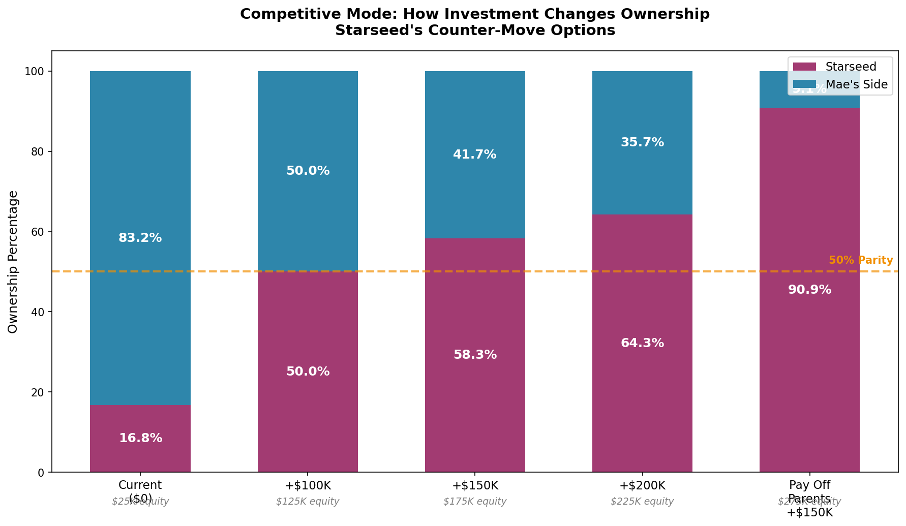
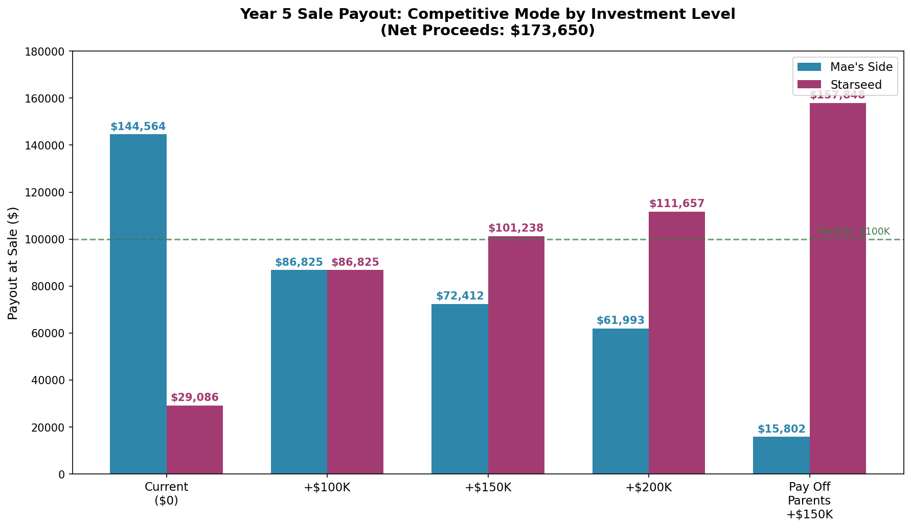
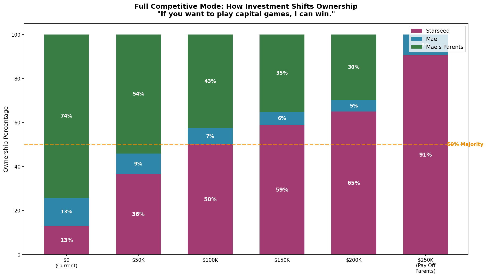
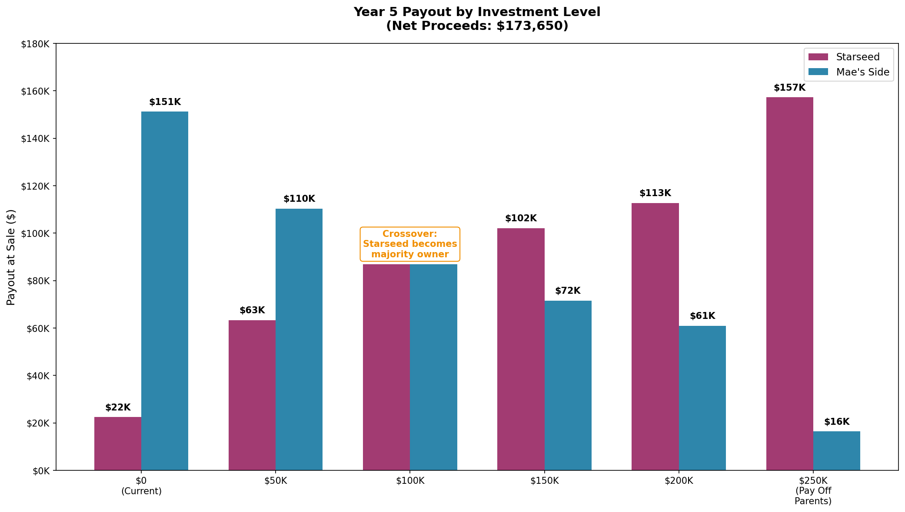
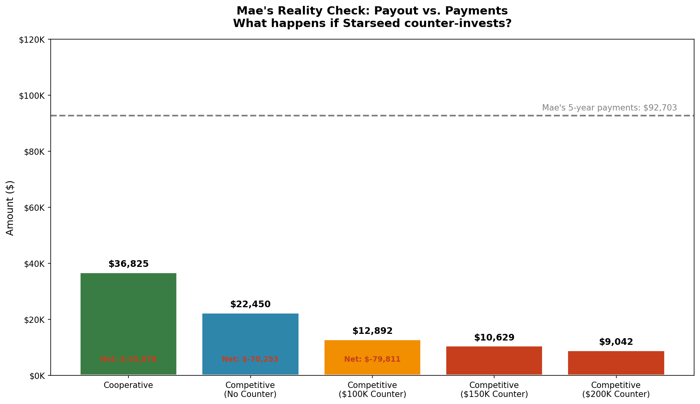
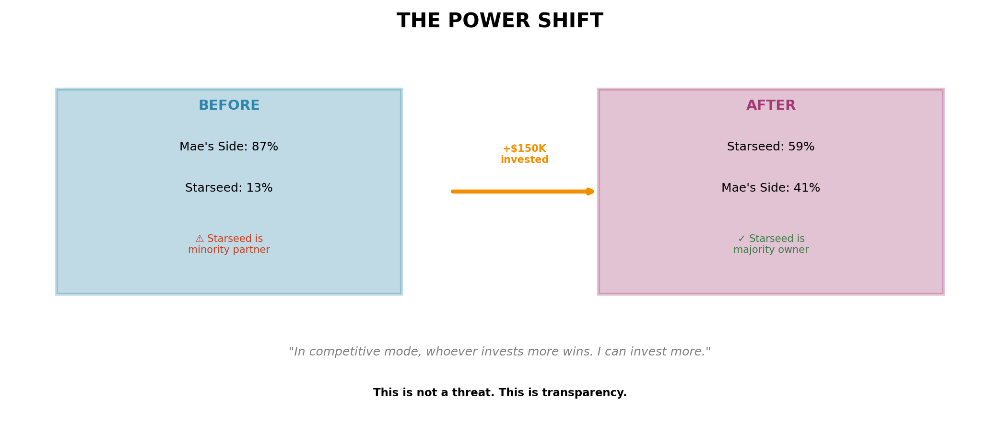
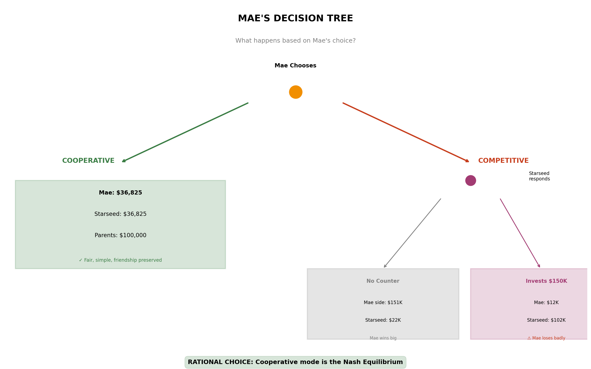

# Competitive Scenario Models

This document models how ownership percentages change if either party invests additional capital under a capital-based ownership model.

---

## Current Competitive Position (Year 5)

| Party | Capital Invested | Ownership % |
|-------|------------------|-------------|
| Mae's parents | $100,000 | 66.5% |
| Mae (principal paid) | $25,185 | 16.75% |
| Starseed (principal paid) | $25,185 | 16.75% |

**Mae's side: 83.25% / Starseed: 16.75%**

---

## What If Starseed Invests More?

### Option 1: Match Parents ($100K investment)

| Party | New Capital | New Ownership |
|-------|-------------|---------------|
| Parents | $100,000 | 42.6% |
| Mae | $17,437 | 7.4% |
| Starseed | $117,437 | **50.0%** |

**Result:** Starseed reaches parity.

### Option 2: Majority Position ($150K investment)

| Party | New Capital | New Ownership |
|-------|-------------|---------------|
| Parents | $100,000 | 35.1% |
| Mae | $17,437 | 6.1% |
| Starseed | $167,437 | **58.8%** |

**Result:** Starseed becomes majority owner.

### Option 3: Dominant Position ($200K investment)

| Party | New Capital | New Ownership |
|-------|-------------|---------------|
| Parents | $100,000 | 29.8% |
| Mae | $17,437 | 5.2% |
| Starseed | $217,437 | **65.0%** |

**Result:** Starseed becomes dominant owner.

---

## Competitive Payouts by Investment Level

---

## Full Competitive Mode: "Playing to Win"

If taken to the extreme, here's what happens:

### Mae's Reality Check

### The Power Shift

### Mae's Decision Tree

---

## Key Takeaway

In a capital-based ownership model, ownership percentages shift significantly based on who invests additional capital. This is an important dynamic to understand when choosing between cooperative and competitive ownership structures.
