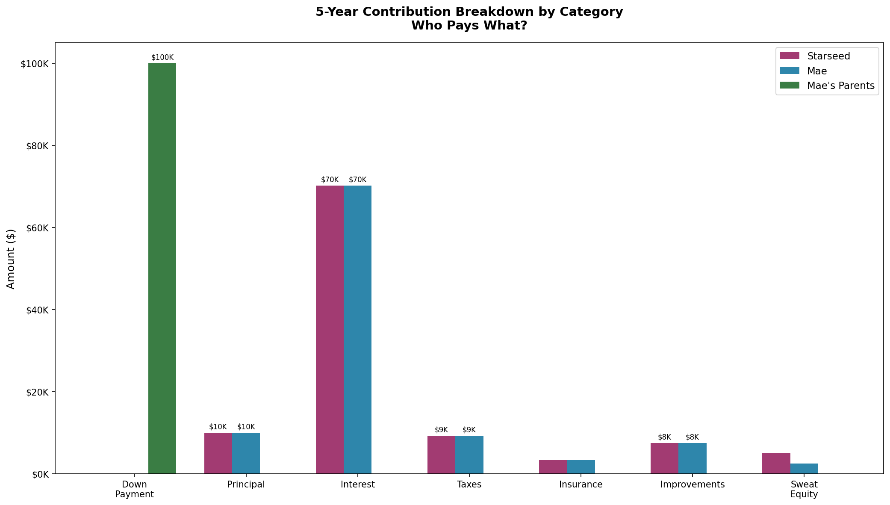
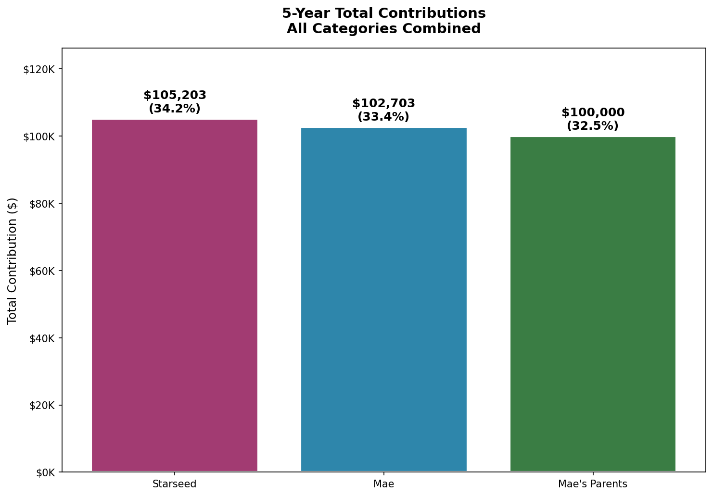
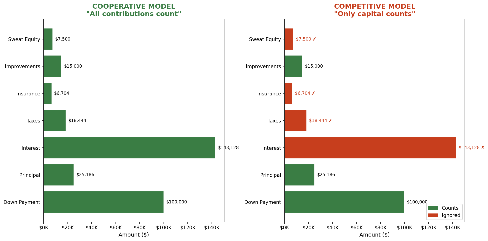
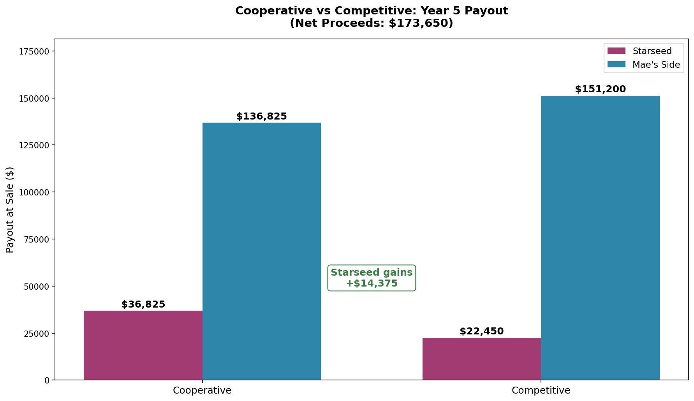

# Comprehensive Contribution Model: Cooperative vs. Competitive

## Verified Payment Data

| Item | Monthly | Annual | Source |
|------|---------|--------|--------|
| **Total Payment** | $3,090.10 | $37,081.20 | Guild Statement |
| Principal | $285.51 | varies | Statement (Jan 2026) |
| Interest | $2,385.46 | ~$28,564 | Statement |
| Escrow (Tax + Insurance) | $419.13 | $5,029.56 | Statement |

---

## Year 1 Contribution Summary (8 months: June 2025 - Jan 2026)

| Category | Starseed | Mae | Mae's Parents | Total |
|----------|----------|-----|---------------|-------|
| Down Payment | $0 | $0 | $100,000 | $100,000 |
| Principal (8 mo) | $1,142 | $1,142 | $0 | $2,284 |
| Interest (8 mo) | $9,542 | $9,542 | $0 | $19,084 |
| Taxes (8 mo) | $1,230 | $1,230 | $0 | $2,460 |
| Insurance (8 mo) | $447 | $447 | $0 | $894 |
| Capital Improvements | $3,000 | $0 | $0 | $3,000 |
| Sweat Equity | $2,000 | $0 | $0 | $2,000 |
| **TOTAL** | **$17,361** | **$12,361** | **$100,000** | **$129,722** |

---

## 5-Year Projection

| Category | Starseed | Mae | Mae's Parents | Total |
|----------|----------|-----|---------------|-------|
| Down Payment | $0 | $0 | $100,000 | $100,000 |
| Principal (60 mo) | $12,593 | $12,593 | $0 | $25,186 |
| Interest (60 mo) | $71,564 | $71,564 | $0 | $143,128 |
| Taxes (60 mo) | $9,222 | $9,222 | $0 | $18,444 |
| Insurance (60 mo) | $3,352 | $3,352 | $0 | $6,704 |
| Capital Improvements | $7,500 | $7,500 | $0 | $15,000 |
| Sweat Equity | $5,000 | $2,500 | $0 | $7,500 |
| **TOTAL** | **$109,231** | **$106,731** | **$100,000** | **$315,962** |

### Percentage of Total Contributions

| Party | Cash Only | Including Sweat Equity |
|-------|-----------|------------------------|
| Starseed | 33.4% | 34.2% |
| Mae | 33.4% | 33.4% |
| Mae's Parents | 33.3% | 32.5% |

**The reality:** By Year 5, all three parties have contributed roughly equal amounts of value.

---

## Cooperative vs. Competitive: What Counts?

### Cooperative Model -- What Counts

| Category | Counted? |
|----------|----------|
| Down Payment | Yes (returned first) |
| Principal | Yes |
| Interest | Yes |
| Taxes | Yes |
| Insurance | Yes |
| Capital Improvements | Yes |
| Sweat Equity | Yes |

### Competitive Model -- What Counts

| Category | Counted? |
|----------|----------|
| Down Payment | Yes (primary factor) |
| Principal | Yes |
| Interest | No (operating expense) |
| Taxes | No |
| Insurance | No |
| Capital Improvements | Yes |
| Sweat Equity | No |

---

## Side-by-Side Comparison (Year 5, $173,650 net proceeds)

| Party | Cooperative | Competitive | Difference |
|-------|-------------|-------------|------------|
| Mae's Parents | $100,000 | $103,649 | +$3,649 |
| Mae | $36,825 | $20,830 | -$15,995 |
| Starseed | $36,825 | $20,830 | -$15,995 |
| **Mae's Side Total** | **$136,825** | **$124,479** | **-$12,346** |
| **Starseed Total** | **$36,825** | **$20,830** | **-$15,995** |

### Key Insight

In **Cooperative mode**, all monthly payments are recognized. In **Competitive mode**, 85%+ of Starseed's contributions are ignored because interest, taxes, and insurance "don't count."

---

## Recommendation

**Cooperative mode is clearly better** because it recognizes all contributions -- not just the small principal portion of payments.

> "By Year 5, I will have put over $100,000 into this house. If we only count 'capital,' that erases 85% of my contribution. That doesn't seem fair."
